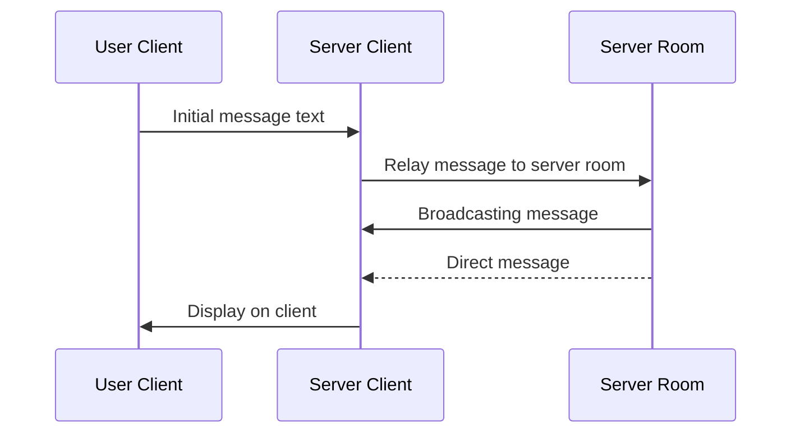

# Program Flow

## Life of a Mesage

```mermaid
sequenceDiagram

participant C as User Client
participant SC as Server Client
participant SR as Server Room

C ->> SC: Initial message text
SC ->> SR: Relay message to server room
SR ->> SC: Broadcasting message
SR -->> SC: Direct message
SC ->> C: Display on client
```
