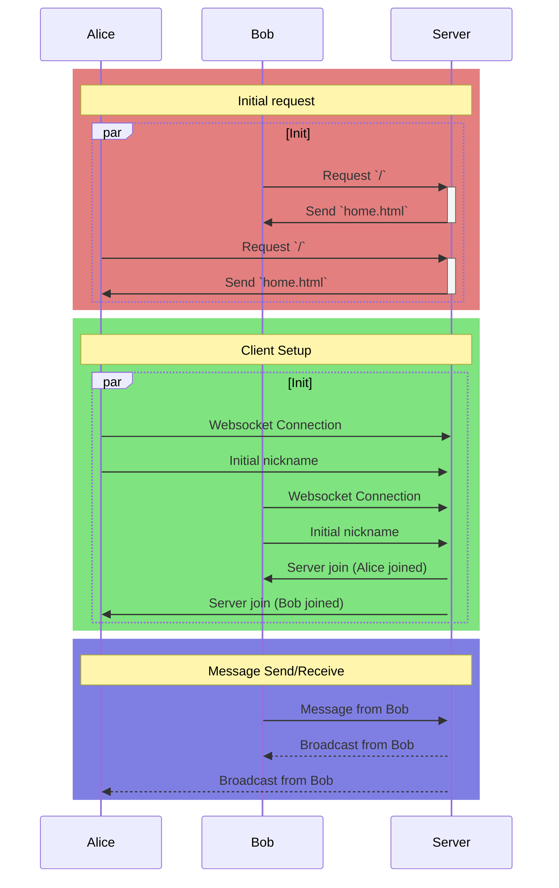

# Program Flow

```mermaid
sequenceDiagram

participant A as Alice
participant B as Bob
participant Server

rect rgba(200, 0, 0, 0.5)
Note over A, Server: Initial request
par Init
B ->>+ Server: Request `/`
Server ->>- B: Send `home.html`
A ->>+ Server: Request `/`
Server ->>- A: Send `home.html`
end
end
rect rgba(0, 200, 0, 0.5)
Note over A, Server: Client Setup
par Init
A ->> Server: Websocket Connection
A ->>+ Server: Initial nickname
B ->> Server: Websocket Connection
B ->>+ Server: Initial nickname
Server ->> B: Server join (Alice joined)
Server ->> A: Server join (Bob joined)
end
end

rect rgba(0, 0, 200, 0.5)
Note over A, Server: Message Send/Receive
B ->> Server: Message from Bob
Server -->> B: Broadcast from Bob
Server -->> A: Broadcast from Bob
end
```
