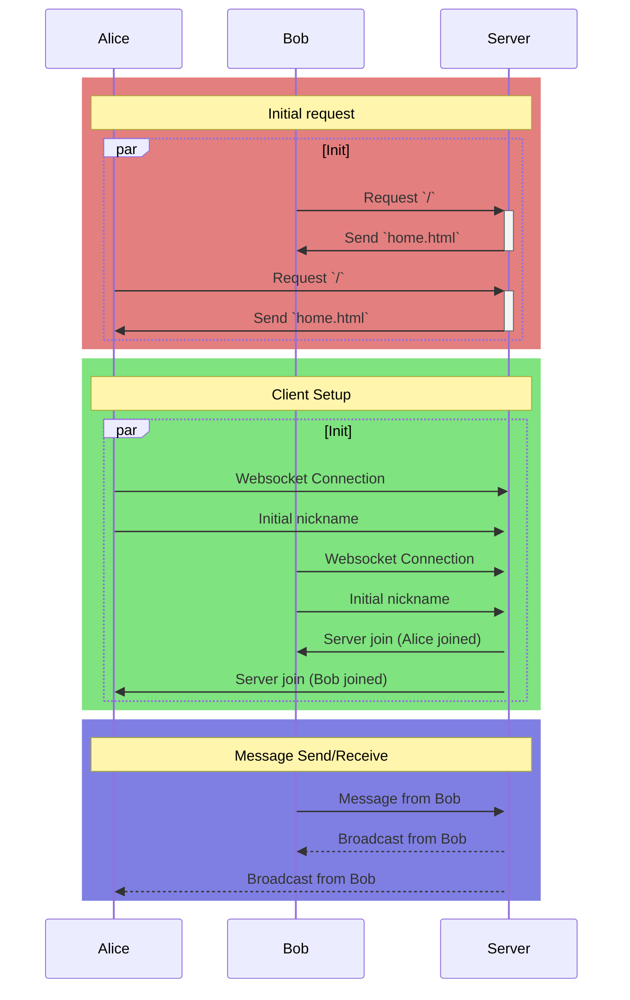

# Program Flow

## Server-Room-Client Hierarchy

The network can be thought of as a tree of servers, clients, and rooms.
A single server acts as the "hub" for several other servers;
this is used for routing messages coming from a local room with a destination room that is not in the current server.
Each server contains multiple rooms that multiple clients can join and chat in.

```mermaid
graph LR

SA(["Server A (hub)"]):::server
SB([Server B]):::server
SC([Server C]):::server

R1(Room 1):::room
R2(Room 2):::room
R3(Room 3):::room
R4(Room 4):::room
R5(Room 5):::room

Ca[Client a]:::client
Cb[Client b]:::client
Cc[Client c]:::client
Cd[Client d]:::client
Ce[Client e]:::client
Cf[Client f]:::client
Cg[Client g]:::client

SA -.- SB
SA -.- SC

SA --- R1 & R2
SB --- R3 & R4
SC --- R5

R1 --- Ca
R1 --- Cb
R2 --- Cc
R2 --- Cd
R3 --- Ce
R4 --- Cf
R5 --- Cg

classDef server fill:#500
classDef room fill:#050
classDef client fill:#005
```

## Life of a Message

Messages begin in a client, when after the user sends their text message.
The client takes the inputted text, packs it into a JSON object, and sends it to the connected server.
The connected server reads the JSON object from the client's websocket connection and packs it into a struct for processing.
The server then determines which room this message should be broadcast to based on a field in the message.
If the room exists in the local server, it sends it to the room to be broadcasted.
Otherwise, the local server sends the message to a parent hub server for further routing.
when a hub server receives a message from one of its child servers, it will check the message's destination field for the correct server to route it to.
Each server knows what rooms are available to it, so the hub server can pick the correct child server to relay the message to.
Once the room is found, the hub server sends the message to the child server containing that room.
Regardless of where the message came from, if a message is meant for a server's local room, it will broadcast/relay the message to all clients current in the room.
The clients then receive the message (as JSON), unpack it, and display the message contents to the user.

## Typical Session

